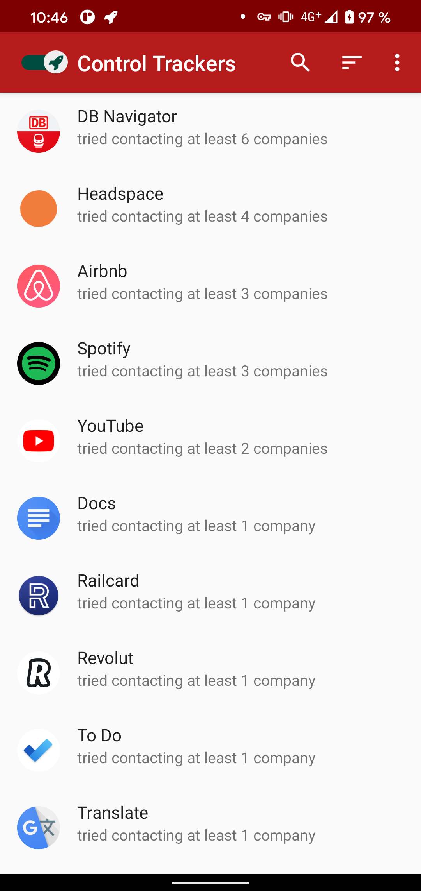
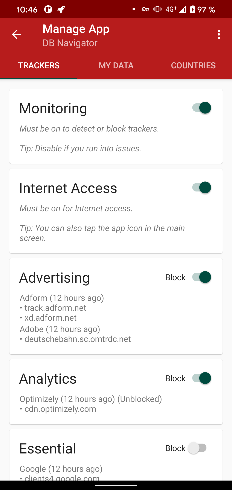
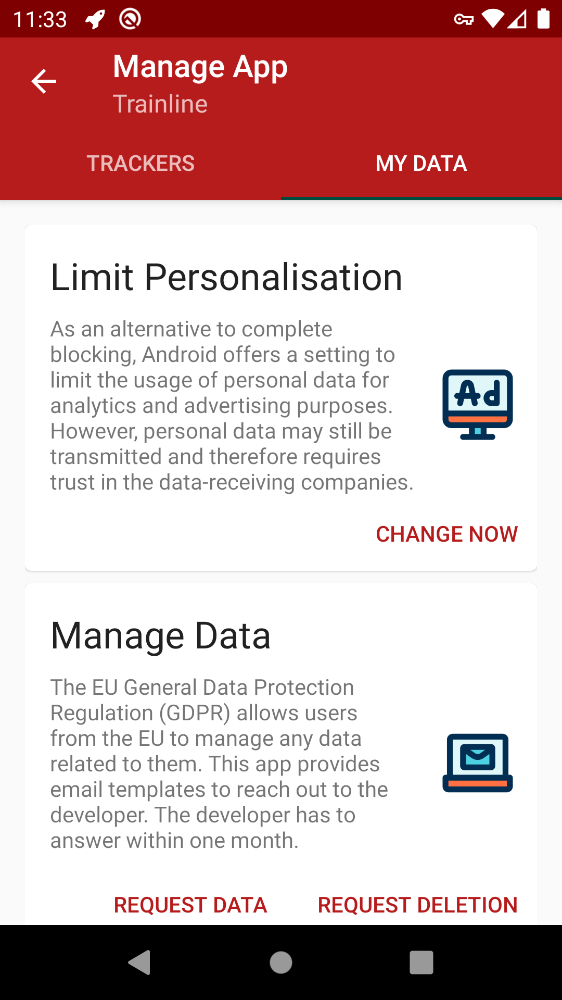

# TrackerControl for Android

[](https://crowdin.com/project/trackercontrol) [](https://www.gnu.org/licenses/gpl-3.0)

*If you have missing features or bugs, join the [community](#communities), use the [issue tracker](https://github.com/TrackerControl/tracker-control-android/issues), or contact Konrad directly (<hello@trackercontrol.org>)!*

TrackerControl is an Android app that allows users to monitor and control the widespread,
ongoing, hidden data collection in mobile apps about user behaviour ('tracking').

To detect tracking, TrackerControl combines the power of the *Disconnect blocklist*, 
used by Firefox, and of our in-house blocklist, created *from analysing ~2&nbsp;000&nbsp;000 apps*!
Additionally, TrackerControl supports custom blocklists and uses the signatures from [ClassyShark3xodus](https://f-droid.org/en/packages/com.oF2pks.classyshark3xodus/)/[Exodus Privacy](https://exodus-privacy.eu.org/) for the analysis of tracker libraries within app code.

This approach
- reveals the companies behind tracking,
- allows to block tracking selectively, and
- exposes the purposes of tracking, such as analytics or advertising.

The app also aims to educate about *your rights* under Data Protection Law, such the EU General Data Protection Regulation (GDPR).

Under the hood, TrackerControl uses Android's VPN functionality,
to analyse apps' network communications *locally on the Android device*.
This is accomplished through a local VPN server, to enable network traffic analysis by TrackerControl.

No root is required, other VPNs or Private DNS are not supported.
No external VPN server is used, to keep your data safe! TrackerControl even protects you
against *DNS cloaking*, a popular technique to hide trackers in websites and apps.

TrackerControl will always be free and open source, being a research project.

## Contents
- [Download / Installation](#download--installation)
- [Example Use](#example-use)
- [Contributing](#contributing)
- [Communities](#communities)
- [Translation](#translation)
- [Highlights](#highlights)
- [Build Instructions](#build-instructions)
- [Privacy Notice](#privacy-notice)
- [Cookie Policy](#cookie-policy)
- [Credits](#credits)
- [License](#license)
- [Citation](#citation)

## Download / Installation
*Disclaimer: The usage of this app is at your own risk. No app can offer 100% protection against tracking. Analysis results shown within the app might be inaccurate.*

[](https://github.com/TrackerControl/tracker-control-android/releases/latest/download/TrackerControl-githubRelease-latest.apk)
[](https://f-droid.org/app/net.kollnig.missioncontrol.fdroid)

[](https://apt.izzysoft.de/fdroid/index/apk/net.kollnig.missioncontrol)
[](https://play.google.com/store/apps/details?id=net.kollnig.missioncontrol.play)

There are multiple versions of TrackerControl.

If you're interested in *blocking* tracking, then best download TrackerControl from [here](https://github.com/TrackerControl/tracker-control-android/releases/latest/download/TrackerControl-githubRelease-latest.apk), from [F-Droid](https://f-droid.org/packages/net.kollnig.missioncontrol.fdroid), or from the [IzzyOnDroid](https://apt.izzysoft.de/fdroid/index/apk/net.kollnig.missioncontrol) F-Droid Repository.

If you're interested in *analysing* tracking and generating factual evidence of it (e.g. for research), then choose the version from [Google Play](https://play.google.com/store/apps/details?id=net.kollnig.missioncontrol.play). The analysis results from this version will usually be more accurate.

## Example Use

TrackerControl is mainly designed to help you investigate the tracking practices of the apps on your smartphone. For this purpose, TrackerControl combines two analysis techniques: tracker library analysis and network traffic analysis.

### Network traffic analysis

Mobile trackers rely on the sending of personal data over the internet. This is why tracking can be detected and analysed from apps' network traffic. This is the core functionality of TrackerControl. The advantage of this approach over tracker library analysis is that actual evidence of data sharing is gathered; by contrast, when analysing solely the presence of tracking libraries in apps, some of these libraries may never be activated by an app at run-time.

At the moment, TrackerControl Slim, available on the [Google Play Store](https://play.google.com/store/apps/details?id=net.kollnig.missioncontrol.play) is the preferred tool for tracking analysis, because this version of TrackerControl does not block network traffic and additionally resolves contacted domains using TLS Server Name Indication.

You analyse apps network traffic by following the steps within the app to enable the VPN. Consequently, TrackerControl keeps track of any contacted tracking domain. Note that you need to interact with apps of interest in order to make these apps share data with tracking companies over the internet.

You can export the results of your analysis from the app menu TrackerControl to CSV ("Export as CSV"). If you export to CSV from the main screen of TrackerControl, you can create nice visualisations of your exported traffic data using purpose-built software by [Hestia Labs](https://digipower.academy/experience/tracker-control).

It is further possible to enable the direct logging of contacted domains to the console. This is helpful for research studies that instrument apps using an additional computer and can be enabled through Settings -> Advanced options -> Log transmissions to ADB. Note that this disables any blocking.

By default, the analysis of system apps is disabled. This is because the analysis of the network traffic of system apps can lead to unexpected behaviour and should only be used by experienced users. You can enable the analysis of system apps through Settings -> Advanced Options -> Manage system apps. The analysis of system apps might be helpful if you want to analyse the data sharing of sytem apps, such as Google Maps, YouTube or the Google Play Service, all of which might be used by other apps to do tracking for them. In other words, without looking at system apps, some tracking might be missed; the challenge here, however, is that it's difficult to differentiate different apps that use other Google apps for tracking. This means that for a robust analysis, it's prudent to uninstall and deactivate as many apps on the user's phone as possible.

TrackerControl also has a traffic log functionality that can be accssed from the menu bar. If enabled, contacted tracking domains will be highlighted in **bold**. Note, however, that the traffic log currently lacks a display of whether there's ambiguity in the contacted domains (as opposed to the per-app screens that show when certain domains are *uncertain*). Displayed domains can be inaccurate.

### Tracker library analysis

In addition to the analysing of apps' network traffic, TrackerControl can also detect the presence of tracking libraries within apps' code. Compared to network traffic analysis, this approach might pick up additional tracking practices that are not observed during testing in a lab setting, but may occur in a real-world scenario.

The analysis of tracker libraries in code is rather straightforward. You only need to select an app of interest from the main screen of TrackerControl.

## Contributing

TrackerControl is a community-driven project and welcomes contributions of all kinds. This does not require programming skills.

If you need support in using the app, join one of the [online communities](https://github.com/TrackerControl/tracker-control-android#communities).

If you find any errors or bugs or have suggestions for improvements, you can use the [issue tracker](https://github.com/TrackerControl/tracker-control-android/issues). The issue tracker provides two different templates, one one for bugs and the other for improvements.

If you want to contribute directly to code of TrackerControl, feel free to file a pull request or, alternatively, use the [issue tracker](https://github.com/TrackerControl/tracker-control-android/issues).

If you do not have programming skills, here are some further suggestions on how you can support the project:

1. Help [translate](https://github.com/TrackerControl/tracker-control-android#translation) the app into your language.
2. Rate the (feature-reduced version of the) app on [Google Play](https://play.google.com/store/apps/details?id=net.kollnig.missioncontrol.play).
3. Join one of the [online communities](https://github.com/TrackerControl/tracker-control-android#communities) and share your ideas on make the app better.
4. Tell your friends how to protect their privacy with TrackerControl.
5. Leave a star on GitHub.

Also, you can always reach out to the main developer Konrad directly at <hello@trackercontrol.org>. I deeply welcome and answer every message.

## Communities

1. Telegram Discussion Group: <https://t.me/TrackerControl>
2. Telegram News Channel: <https://t.me/TrackerControlChannel>
3. ~~Matrix Community: <https://matrix.to/#/!htazLJNOSogSGbSPQL:matrix.org?via=matrix.org>~~ (temporarily closed due to spam)
4. /e/ Community: <https://community.e.foundation/t/trackercontrol-a-way-to-neutralize-in-app-trackers/>
5. XDA Developers: <https://forum.xda-developers.com/android/apps-games/control-trackers-ads-t4161821>

## Translation

If you're missing a translation, feel free to contribute here: <https://crowdin.com/project/trackercontrol>.

Contact me at hello@trackercontrol.org, if you're missing a language.

## Highlights
TrackerControl provides
- *real-time monitoring* of app tracking, including destination companies and countries,
- *granular blocking* of app tracking,
- *one-click data requests* as granted under EU Data Protection Legislation,
- *ad-blocking* using widely available host files, and
- *tracker library analysis* of apps' code.

<p align="center">
    
    
    
</p>

Contrary to similar solutions, this application does not intercept SSL
connections, minimising privacy risks and allowing for usage on
unrooted Android devices.
Only the meta data about network communications is logged, and displayed
to the users.

Download [here](https://github.com/TrackerControl/tracker-control-android/releases/latest/download/TrackerControl-githubRelease-latest.apk).

## Build Instructions

Building this project is rather straightforward. In combination with F-Droid, this repository currently uses automated builds and therefore complies with a standard Android build pipeline.

For building, you need:
- Android Studio (including a default installation of the Android SDK, including build tools)
- Android NDK (all recent versions should be compatible)

Next, you just need to start the building process from within Android Studio.

Alternatively, you can also use the provided gradle wrapper for building. Details on this can be found in the [Android developer documentation](https://developer.android.com/studio/build/building-cmdline).

If you find any problems with these instructions, feel free to file this in the [issue tracker](https://github.com/TrackerControl/tracker-control-android/issues).

## Privacy Notice

TrackerControl does not send any personal data off your device.

TrackerControl allows users to monitor the network communications on their
Android device.
This network data qualifies as personal data, but is only processed
locally on the user's device.

If the user consents, TrackerControl contacts the Google Play Store
to retrieve further information about the users' apps.
The app automatically contacts GitHub to check for updates,
which can be disabled from the app settings.
No personal data is ever shared, other than what is strictly
necessary for network communications (e.g. IP address).

TrackerControl uses the ACRA plugin. This is considered to be a 'good' tracker.
It's open-source, and could be used to collect crash reports automatically
to a server–TrackerControl DOES NOT do this. Instead, the user must app report crashes
manually, via e-mail. ACRA shows a dialog to do this in TrackerControl.

TrackerControl itself never sends any personal data off your device. 

## Cookie Policy

TrackerControl does not use cookies of any kind.

The only information saved on the user's device is non-identifying
and strictly necessary for the operation of TrackerControl:

1. a database of network communications, and
2. user settings.

This information is kept on the user's device until app data is
removed manually by the user (e.g. by uninstalling).

## Credits

The development of TrackerControl was led by Konrad Kollnig (University of Oxford). The underlying network analysis functionality is provided by the [NetGuard Firewall](https://github.com/M66B/NetGuard), developed by Marcel Bokhorst.

TrackerControl would not have been possible without the help of many outstanding minds, including Max Van Kleek, Katherine Fletcher, George Chalhoub, Sir Nigel Shadbolt and numerous app testers and friends.

The app builds upon a range of publicly available resources:

*X-Ray Tracker List:* TrackerControl also uses the tracker blocklist by Reuben Binns, Ulrik Lyngs,
Max Van Kleek, Jun Zhao, Timothy Libert, and Nigel Shadbolt from the [X-Ray project](https://www.sociam.org/mobile-app-x-ray), created *from analysing ~1&nbsp;000&nbsp;000 apps*.
This database was released as part of their 2018 paper on
[Third Party Tracking in the Mobile Ecosystem](https://doi.org/10.1145/3201064.3201089).
The original data can be retrieved [here](https://osf.io/4nu9e/).

*Disconnect Tracker List:* TrackerControl integrates the [Disconnect list](https://github.com/mozilla-services/shavar-prod-lists) of known tracker domains,
that is distributed with the Firefox browser.

*Steven Black's Blocklist*: A state-of-the-art blocklist. This is used as fallback, if no company information is known from the other tracker lists. More [here](https://github.com/StevenBlack/hosts).

*Icons:* The app uses icons made by [bqlqn](https://www.flaticon.com/authors/bqlqn) from [www.flaticon.com](https://www.flaticon.com/), and a [rocket icon](https://www.iconfinder.com/icons/1608817/rocket_icon) by Dave Gandy under the SIL Open Font License.

*GDPR Requests:* For the GDPR requests, the templates from the website [My Data Done Right](https://www.mydatadoneright.eu/) by the NGO "Bits of Freedom" were adopted.

*Country Visualisation*: TrackerControl offers to visualise the countries to which trackers sent data. The code was kindly offered by [Takuma Seno](https://github.com/takuseno/GeoMap). To map IP addresses to countries, TrackerControl includes the GeoLite2 database, created by MaxMind, available from <https://www.maxmind.com>.

*ClassyShark3xodus*: TrackerControl allows to detect trackers in the app code. The signatures to do this are taken from [ClassyShark3xodus](https://bitbucket.org/oF2pks/fdroid-classyshark3xodus/src/master/ClassySharkAndroid/app/src/main/res/values/arrays.xml).

*sniproxy*: TrackerControl uses code that has been derived from an early version of [sniproxy](https://github.com/dlundquist/sniproxy) to parse the Server Name Indication (SNI) in TLS headers in accordance with the associated [IETF standard](https://datatracker.ietf.org/doc/html/rfc3546).

*Peter Lowe's Blocklist*: TrackerControl uses the IP blocklist provided by [Peter Lowe](https://pgl.yoyo.org/adservers/iplist.php). Note that this bans anyone from making money from this, see the [license](https://pgl.yoyo.org/license/).

*DuckDuckGo Tracker Radar*: TrackerControl uses some (but not all) [information](https://github.com/duckduckgo/tracker-radar) that lies at the heart of DuckDuckGo's tracking analysis technologies.

## License
Except where indicated otherwise, this project is licensed under [GPLv3](https://www.gnu.org/licenses/gpl-3.0.html).


## Citation

If you use this project as part of your academic studies, please kindly cite the below article:

```
@article{kollnig2022_app,
     doi = {10.21105/joss.04270},
     year = {2022},
     publisher = {The Open Journal},
     volume = {7},
     number = {75},
     pages = {4270},
     author = {Konrad Kollnig and Nigel Shadbolt},
     title = {TrackerControl: Transparency and Choice around App Tracking},
     journal = {Journal of Open Source Software}
}

@inproceedings {kollnig2021_consent_analysis,
      author = {Konrad Kollnig and Pierre Dewitte and Max Van Kleek and Ge Wang and Daniel Omeiza and Helena Webb and Nigel Shadbolt},
      title = {A Fait Accompli? An Empirical Study into the Absence of Consent to Third-Party Tracking in Android Apps},
      booktitle = {{Seventeenth Symposium on Usable Privacy and Security (SOUPS 2021)}},
      year = {2021},
      isbn = {978-1-939133-25-0},
      pages = {181--196},
      url = {https://www.usenix.org/conference/soups2021/presentation/kollnig},
      publisher = {{USENIX Association}},
      month = aug,
}
```

## References

- Song, Y., & Hengartner, U. (2015). PrivacyGuard: A VPN-based Platform to Detect Information Leakage on Android Devices. *Proceedings of the 5th Annual ACM CCS Workshop on Security and Privacy in Smartphones and Mobile Devices - SPSM ’15*, 15–26. https://doi.org/10.1145/2808117.2808120
- Le, A., Varmarken, J., Langhoff, S., Shuba, A., Gjoka, M., & Markopoulou, A. (2015). AntMonitor: A System for Monitoring from Mobile Devices. *Proceedings of the 2015 ACM SIGCOMM Workshop on Crowdsourcing and Crowdsharing of Big (Internet) Data - C2B(1)D ’15*, 15–20. https://doi.org/10.1145/2787394.2787396
- Binns, R., Zhao, J., Kleek, M. V., & Shadbolt, N. (2018). Measuring Third-party Tracker Power across Web and Mobile. *ACM Transactions on Internet Technology*, *18*(4), https://doi.org/10.1145/3176246
- Van Kleek, M., Binns, R., Zhao, J., Slack, A., Lee, S., Ottewell, D., & Shadbolt, N. (2018). X-Ray Refine: Supporting the Exploration and Refinement of Information Exposure Resulting from Smartphone Apps. *Proceedings of the 2018 CHI Conference on Human Factors in Computing Systems - CHI ’18*, https://doi.org/10.1145/3173574.3173967
- Kollnig, K., Binns, R., Dewitte, P., Kleek, M. V., Wang, G., Omeiza, D., Webb, H., & Shadbolt, N. (2021). A Fait Accompli? An Empirical Study into the Absence of Consent to Third-Party Tracking in Android Apps. *Seventeenth Symposium on Usable Privacy and Security (SOUPS 2021)*. https://www.usenix.org/system/files/soups2021-kollnig.pdf
- Kollnig, K., Binns, R., Kleek, M. V., Lyngs, U., Zhao, J., Tinsman, C., & Shadbolt, N. (2021). Before and after GDPR: Tracking in mobile apps. *Internet Policy Review*, *10*(4). https://policyreview.info/articles/analysis/and-after-gdpr-tracking-mobile-apps
