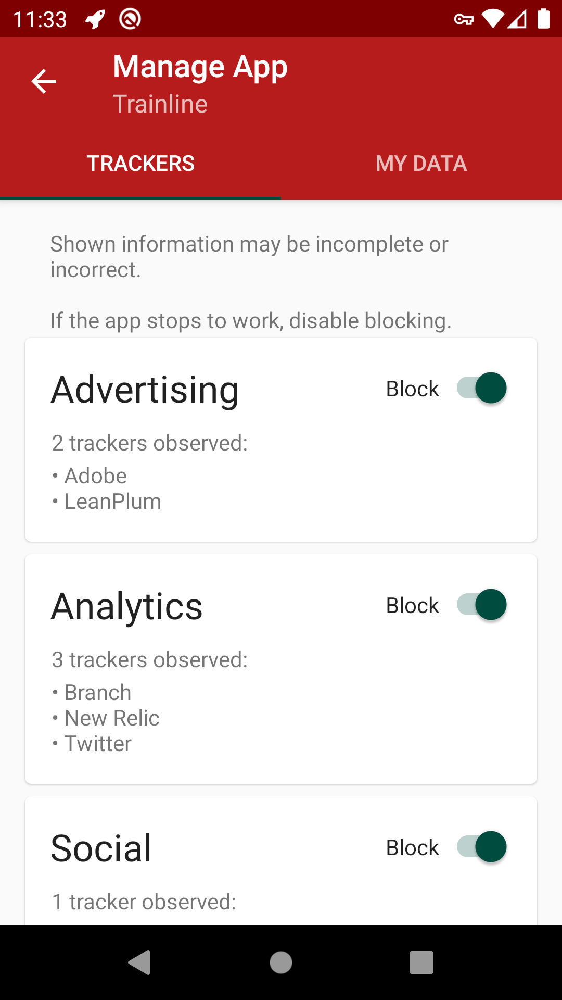
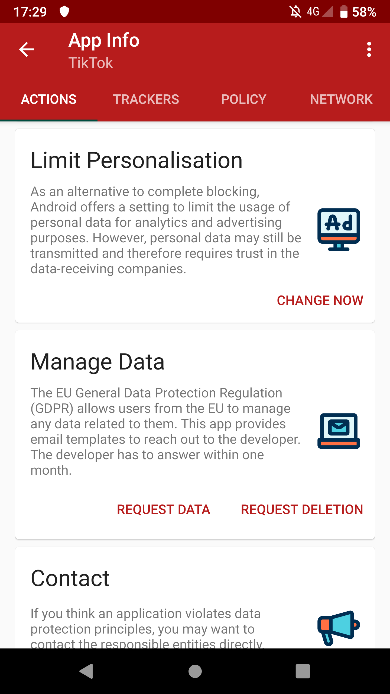

# TrackerControl (experimental)

**If you're missing features or find bugs, use the issue tracker or contact Konrad directly (tc@kollnig.net).**

TrackerControl allows users to monitor and control the widespread,
ongoing, hidden data collection in mobile apps about user behaviour ('tracking').

  

To visualise this tracking, a compehensive database of
tracker companies from the X-Ray project,
developed by Professor Max Van Kleek (University of Oxford)
and others,
is used to **reveal the companies behind tracking** to users
and to allow users to **block tracking selectively**.

The app further aims to educate users about their **legal rights** under
current EU Data Protection Law (i.e. GDPR and the ePrivacy Directive)

Under the hood, TrackerControl uses Android's VPN functionality,
to analyse apps' network communications *locally on the Android device*.
This is accomplished through a local VPN server, through which all network communications
are passed, to enable the analysis by TrackerControl.
In other words,
no external VPN server is used, and hence
no network data leaves the user's device for the purposes of tracker analysis.

TrackerControl was developed by Konrad Kollnig, as part of his MSc thesis
in Computer Science at the University of Oxford, under the supervision
of Professor Max van Kleek.

## Installation
Disclaimer: The app is **experimental** and should not be used on
your regular phone.

The app can be [downloaded here](https://github.com/OxfordHCC/tracker-control-android/releases).

## Key Highlights
TrackerControl provides
- *real-time monitoring* of app tracking,
- *granular blocking* of app tracking,
- access to apps' *privacy policy websites without trackers* (which they often contain), and
- *one-click data requests* as granted under EU Data Protection Legislation,
- [ad-blocking](ADBLOCKING.md) using widely available host files.

    
    
    

Contrary to similar solutions, this application does not intercept SSL
connections, minimising privacy risks and allowing for usage on
unrooted Android devices.
Only the meta data about network communications is logged, and displayed
to the users.

## Build instructions

This project can be built using [Android Studio](https://developer.android.com/studio).

It includes a modified version of the [AntMonitor
Library](https://github.com/UCI-Networking-Group/AntMonitor),
whose source code
can be found at [https://github.com/OxfordHCC/AntMonitor](https://github.com/OxfordHCC/AntMonitor).
This library can be built manually, by cloning the repository and building the
project `antmonitorlib`.
After successful compilation,
copy the compiled library from `AntMonitor/antmonitorlib/build/outputs/aar`
to `tracker-control-android/app/libs/`.

## Privacy notice

TrackerControl allows users to monitor the network communications on their
Android device.
This network data qualifies as personal data, but is only processed
locally on the user's device.

If the user consents, TrackerControl contacts the Google Play Store
to retrieve further information about the users' apps.
No personal data is shared with Google, other than what is strictly
necessary for network communications (e.g. IP address).

TrackerControl saves two pieces of information on the user's device:

1. a database of network communications, and
2. user settings.

This data is necessary for the functioning of TrackerControl.

This information is kept on the user's device until app data is
removed manually by the user (e.g. by uninstalling).

## Credits
The underlying network analysis functionality is provided by the [NetGuard
Firewall](https://github.com/M66B/NetGuard), developed by Marcel Bokhorst.

TrackerControl builds upon the tracker database by Reuben Binns, Ulrik Lyngs,
Max Van Kleek, Jun Zhao, Timothy Libert, and Nigel Shadbolt from the [X-Ray project](https://www.sociam.org/mobile-app-x-ray).
This database was released as part of their 2018 paper on
[Third Party Tracking in the Mobile Ecosystem](https://doi.org/10.1145/3201064.3201089).
The original data can be retrieved [here](https://osf.io/4nu9e/).

The app uses icons made by [bqlqn](https://www.flaticon.com/authors/bqlqn) from [www.flaticon.com](https://www.flaticon.com/), and a [rocket icon](https://www.iconfinder.com/icons/1608817/rocket_icon) by Dave Gandy under the SIL Open Font License

For the GDPR requests, the templates from the website [My Data Done Right](https://www.mydatadoneright.eu/) by the NGO "Bits of Freedom" were adopted.

## License
This project is licensed under
[GPLv2](https://www.gnu.org/licenses/old-licenses/gpl-2.0.html).