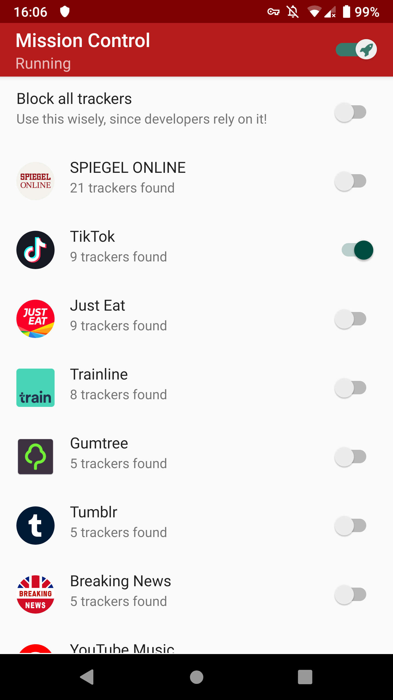

# Tracker Control (work-in-progress)

Tracker Control allows users to monitor and control the widespread,
ongoing, hidden data collection in mobile apps about user behaviour ('tracking').

  

To visualise this tracking, work from Professor Max Van Kleek
and others is used to reveal the *companies behind tracking* to users.

The app further aims to educate users about their *legal rights* under
current EU Data Protection Law.

Under the hood, Tracker Control uses Android's VPN functionality,
to analyse apps' network communications *locally*.
This creates a local VPN server, through all network communications
are passed, which allows monitoring by Tracker Control.
No external VPN server is used.

Tracker Control was developed by Konrad Kollnig, as part of his MSc thesis
in Computer Science at the University of Oxford, under the supervision
of Professor Max van Kleek.

## Key Highlights
Tracker Control provides
- granular choices in tracking of app usage (visualisation and blocking),
- access to privacy policies without trackers (which is often the case),
- a one-click solution for GDPR requests (soon to be added).

    

Contrary to other solutions, this application does not intercept any SSL
connections, minimising privacy risks.
Only the meta data about network communications is logged, and displayed
to the users.

## Build instructions

This project can be built using [Android Studio](https://developer.android.com/studio).

It includes a modified version of the [AntMonitor
Library](https://github.com/UCI-Networking-Group/AntMonitor),
whose source code
can be found at [https://github.com/OxfordHCC/AntMonitor](https://github.com/OxfordHCC/AntMonitor).
This library can be built manually, by cloning the repository and building the
project `antmonitorlib`.
After successful compilcation,
copy the compiled library from `AntMonitor/antmonitorlib/build/outputs/aar`
to `tracker-control-android/app/libs/`.

## Privacy policy

Tracker Control allows users to monitor the network communications on their
Android device.
This network data qualifies as personal data, but is only processed
locally on the userlibrary's device.

If the user consents, Tracker Control contacts the Google Play Store
to retrieve further information about the users' apps.
No personal data is shared with Google, other than what is strictly
necessary for network communications (e.g. IP address).

Tracker Control saves two pieces of information on the user's device:

1. a database of network communications, and
2. user settings.

This data is necessary for the functioning of Tracker Control.

This information is kept on the user's device until app data is
removed manually by the user (e.g. by uninstalling).

## Credits
- The underlying network analysis tool is provided by the [AntMonitor
Library](https://github.com/UCI-Networking-Group/AntMonitor). 

- Tracker Control builds upon a tracker database by Reuben Binns, Ulrik Lyngs,
Max Van Kleek, Jun Zhao, Timothy Libert, and Nigel Shadbolt.
This database was released as part of their 2018 paper on
[Third Party Tracking in the Mobile Ecosystem](https://doi.org/10.1145/3201064.3201089).
The original data can be retrieved [here](https://osf.io/4nu9e/).

- The app uses icons made by [bqlqn](https://www.flaticon.com/authors/bqlqn) from [www.flaticon.com](https://www.flaticon.com/).

## License
This project is licensed under
[GPLv2](https://www.gnu.org/licenses/old-licenses/gpl-2.0.html).