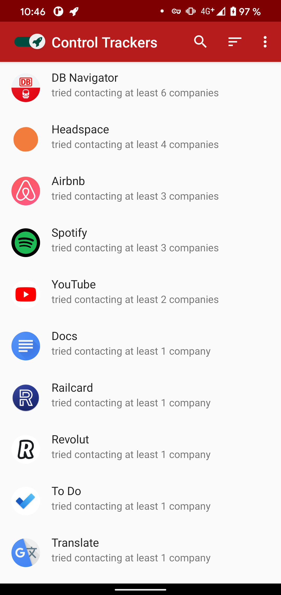
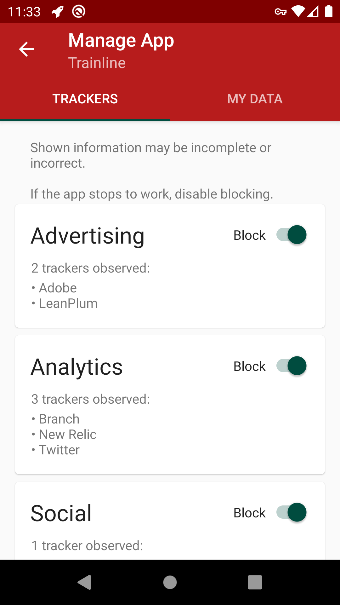
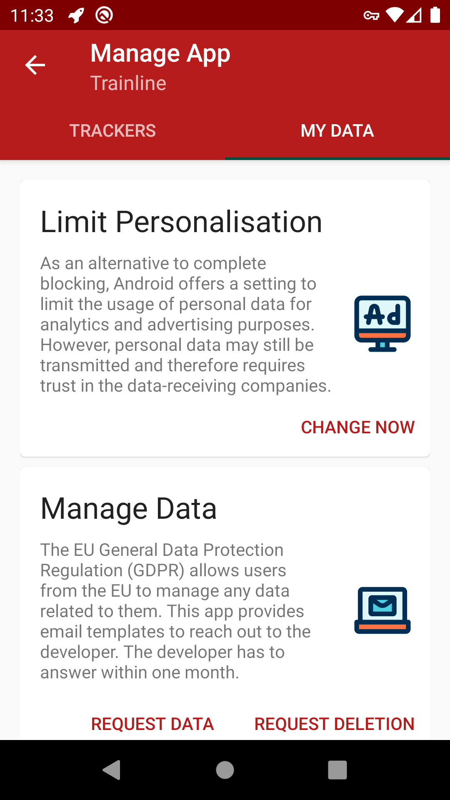

# TrackerControl for Android

[](https://crowdin.com/project/trackercontrol) [](https://www.gnu.org/licenses/gpl-3.0)

TrackerControl is an Android app that monitors and controls the widespread, hidden data collection in mobile apps about user behaviour ('tracking'). It uses Android's VPN functionality to analyse network traffic *locally on the device* — no root, no external VPN server by default, and no personal data leaves the device. TrackerControl also protects against *DNS cloaking*, a popular technique used to hide trackers, and offers optional **Secure DNS (DNS-over-HTTPS)** and **remote VPN routing** through providers like Mullvad and IVPN, for users who want to hide their traffic from their internet provider as well.

To detect tracking, TrackerControl combines the *Disconnect blocklist* (used by Firefox), the *DuckDuckGo Tracker Radar* for mobile apps, and an in-house blocklist created from analysing ~2 000 000 apps. Custom blocklists are supported, and tracker libraries inside app code are detected using signatures from [ClassyShark3xodus](https://f-droid.org/en/packages/com.oF2pks.classyshark3xodus/) / [Exodus Privacy](https://exodus-privacy.eu.org/). The app also aims to educate about *your rights* under data-protection law, such as the EU GDPR.

This approach reveals the companies behind tracking, allows selective blocking, and exposes the *purposes* of tracking (analytics, advertising, etc.).

> A feature-reduced iOS version (tracker analysis only, no blocking) is in the making — see [ios.trackercontrol.org](https://ios.trackercontrol.org).

If you have missing features or bugs, join the [community](#communities), use the [issue tracker](https://github.com/TrackerControl/tracker-control-android/issues), or contact Konrad directly (<hello@trackercontrol.org>).

## Contents
- [Highlights](#highlights)
- [Download / Installation](#download--installation)
- [Example Use](#example-use)
- [VPN Support](#vpn-support)
- [Build Instructions](#build-instructions)
- [Contributing](#contributing)
- [Communities](#communities)
- [Translation](#translation)
- [Privacy](#privacy)
- [Credits](#credits)
- [License](#license)
- [Citation](#citation)
- [References](#references)

## Highlights

TrackerControl provides:

- *real-time monitoring* of app tracking, including destination companies and countries
- *granular blocking* of app tracking
- *one-click data requests* as granted under EU data-protection law
- *ad-blocking* using widely available host files
- *tracker library analysis* of apps' code
- *secure DNS* using DNS-over-HTTPS (optional)
- *remote VPN routing* through providers like Mullvad, IVPN, or your own server (optional)

Unlike similar solutions, TrackerControl does not intercept SSL connections, minimising privacy risks and allowing usage on unrooted devices. Only metadata about network communications is logged and shown to the user.

<p align="center">
    
    
    
</p>

## Download / Installation

*Disclaimer: Use of this app is at your own risk. No app can offer 100% protection against tracking, and analysis results shown within the app may be inaccurate.*

[](https://github.com/TrackerControl/tracker-control-android/releases/latest/download/TrackerControl-githubRelease-latest.apk)
[](https://f-droid.org/app/net.kollnig.missioncontrol.fdroid)
[](https://apt.izzysoft.de/fdroid/index/apk/net.kollnig.missioncontrol)
[](https://play.google.com/store/apps/details?id=net.kollnig.missioncontrol.play)

Two distributions exist:

| Feature | Play Store (Slim) | F-Droid / GitHub (Full) |
| :--- | :---: | :---: |
| **Tracker Analysis** | ✅ | ✅ |
| **Traffic Log** | ✅ | ✅ |
| **Tracker & Ad Blocking** | ✅ (Minimal mode) | ✅ (All modes) |
| **Secure DNS (DoH)** | ✅ | ✅ |
| **Remote VPN routing** | ✅ | ✅ |

The full version offers three **Blocking Modes** (the mode can be changed in Settings):

| | Minimal | Standard | Strict |
| :--- | :---: | :---: | :---: |
| **Tracker lists** | DuckDuckGo only | All (X-Ray, Disconnect, DDG) | All |
| **Essential services** | Allowed | Allowed | Blocked |
| **Ambiguous shared IPs** | Allowed | Allowed | Blocked |
| **Granular per-tracker control** | No | Yes | Yes |
| **Auto-exclude known incompatible apps from VPN** | Yes | No | No |
| **Default for new installs** | Yes | No | No |

- **Minimal** blocks only trackers DuckDuckGo marks as safe to block, and auto-excludes known incompatible apps such as browsers from the VPN.
- **Standard** uses all tracker sources with per-app and per-tracker controls, and allows the `Content` category to reduce breakage.
- **Strict** is like Standard but also blocks the `Content` category and ambiguous mixed shared-IP cases where a tracker hostname and a non-tracker hostname resolve to the same IP.

## Example Use

TrackerControl combines two analysis techniques: network traffic analysis and tracker library analysis.

### Network traffic analysis

Mobile trackers send personal data over the internet, so tracking can be detected from network traffic. This is TrackerControl's core functionality. The advantage over library analysis is that *actual* evidence of data sharing is gathered — libraries present in app code may never be activated at runtime.

TrackerControl analyses traffic locally using DNS-based detection. TLS Server Name Indication (SNI) extraction is disabled by default because it requires connecting to tracker servers, which would leak the user's IP address. SNI is enabled only when Research mode is turned on, for measurement purposes.

Follow the in-app steps to enable the VPN, then interact with the apps you want to inspect (apps must actually run to share data with tracking companies). Results can be exported via the menu ("Export as CSV"); exporting from the main screen produces data compatible with the visualisation tools by [Hestia Labs](https://digipower.academy/experience/tracker-control).

Direct logging of contacted domains to the console can be enabled via the “Research” mode. This is helpful for research studies that instrument apps using an additional computer. Note that this disables blocking.

Analysis of system apps is disabled by default, since it can lead to unexpected behaviour and is intended for experienced users. Enable it via Settings → Advanced Options → Manage system apps. This is useful for inspecting Google Maps, YouTube, or Google Play Services, which other apps may piggyback on for tracking — though attributing such activity to specific apps is difficult, so a robust analysis benefits from uninstalling as many apps as possible first.

A traffic log is also available from the menu bar; if enabled, contacted tracking domains are highlighted in **bold**. The traffic log does not currently indicate ambiguity in contacted domains (unlike the per-app screens, which mark *uncertain* domains).

### Tracker library analysis

In addition to traffic analysis, TrackerControl can detect tracking libraries within app code. This may surface tracking that is not observed during lab testing but happens in real-world use. Just select an app of interest from the main screen.

## VPN Support

By default, TrackerControl's built-in VPN stays on your device — it analyses and filters traffic locally and never sends your traffic to an outside server. As an optional second step, TrackerControl can also send your already-filtered traffic through a *remote VPN provider*, which hides your traffic from your internet provider.

The VPN tab supports three options:

| Option | What it does |
| :--- | :--- |
| **Mullvad** | Sets up a connection through [Mullvad](https://mullvad.net) using just your account number, and lets you pick which country to route through. Only the account number and generated connection details are stored on your device. |
| **IVPN** | Sets up a connection through [IVPN](https://www.ivpn.net) from your account ID, and lets you pick a country. |
| **Custom (WireGuard)** | Imports a configuration file from another VPN provider, your own server, or a workplace endpoint. (WireGuard is the underlying connection type these providers use.) |

When remote routing is on, TrackerControl still filters traffic locally first, then forwards what's allowed through the chosen provider. Secure DNS (DoH) automatically pauses if the provider supplies its own DNS, since DNS is then handled through the remote connection. Connection keys can be rotated from advanced settings.

Note: Android only allows one VPN at a time, so TrackerControl cannot run alongside a separate VPN app, and Android's "Private DNS" is not supported alongside TrackerControl.

## Build Instructions

In combination with F-Droid, this repository uses automated builds and follows a standard Android build pipeline.

You need:
- Android Studio (with the Android SDK and build tools)
- Android NDK (any recent version)
- Rust via [rustup](https://rustup.rs) with the Android targets, for the WireGuard engine ([gotatun](https://github.com/mullvad/gotatun), built from source in `wgbridge-rs/`):
  ```bash
  rustup target add armv7-linux-androideabi aarch64-linux-android i686-linux-android x86_64-linux-android
  cargo install cargo-ndk
  ```

Build from within Android Studio, or use the provided gradle wrapper — see the [Android developer documentation](https://developer.android.com/studio/build/building-cmdline). If you find any problems with these instructions, please file an issue.

## Contributing

TrackerControl is community-driven and welcomes contributions of all kinds — programming skills are not required.

- For support, join one of the [online communities](#communities).
- For bugs or suggestions, use the [issue tracker](https://github.com/TrackerControl/tracker-control-android/issues) (templates exist for both bugs and improvements).
- For code contributions, file a pull request.

Without programming, you can still help by:

1. [Translating](#translation) the app into your language.
2. Rating the app on [Google Play](https://play.google.com/store/apps/details?id=net.kollnig.missioncontrol.play).
3. Joining a [community](#communities) and sharing ideas.
4. Telling friends about TrackerControl.
5. Leaving a star on GitHub.

You can also reach the main developer Konrad directly at <hello@trackercontrol.org> — every message is welcome and answered.

## Communities

1. Telegram Discussion Group: <https://t.me/TrackerControl>
2. Telegram News Channel: <https://t.me/TrackerControlChannel>
3. ~~Matrix Community: <https://matrix.to/#/!htazLJNOSogSGbSPQL:matrix.org?via=matrix.org>~~ (temporarily closed due to spam)
4. /e/ Community: <https://community.e.foundation/t/trackercontrol-a-way-to-neutralize-in-app-trackers/>
5. XDA Developers: <https://forum.xda-developers.com/android/apps-games/control-trackers-ads-t4161821>

## Translation

Missing translations are very welcome: <https://crowdin.com/project/trackercontrol>. If your language isn't listed, contact <hello@trackercontrol.org>.

## Privacy

TrackerControl never sends personal data off your device, except to VPN providers like Mullvad or IVPN when this is enabled. The network communications it monitors itself qualify as personal data, but are processed only locally.

If the user consents, TrackerControl contacts the Google Play Store to retrieve information about installed apps. The app also automatically contacts GitHub to check for updates; this can be disabled in settings. Beyond what is strictly necessary for network communications (e.g. the user's IP address), no personal data is shared.

TrackerControl uses the ACRA library — an open-source, "good" tracker that *could* automatically send crash reports to a server. TrackerControl does not do this; ACRA only shows a dialog so users can manually report crashes via e-mail.

**Cookies and stored data.** TrackerControl does not use cookies. The only information saved on the device is non-identifying and strictly necessary for operation: (1) a database of network communications, and (2) user settings. This data remains on the device until the user clears it (e.g. by uninstalling).

## Credits

Development of TrackerControl is led by Konrad Kollnig (Maastricht University). The underlying network analysis is provided by the [NetGuard Firewall](https://github.com/M66B/NetGuard) by Marcel Bokhorst. TrackerControl would not have been possible without the help of many outstanding minds, including Max Van Kleek, Katherine Fletcher, George Chalhoub, Sir Nigel Shadbolt, and numerous app testers and friends.

The app builds on a range of publicly available resources:

- *X-Ray Tracker List:* the tracker blocklist by Reuben Binns, Ulrik Lyngs, Max Van Kleek, Jun Zhao, Timothy Libert, and Nigel Shadbolt from the [X-Ray project](https://www.sociam.org/mobile-app-x-ray), created from analysing ~1 000 000 apps. Released as part of their 2018 paper on [Third Party Tracking in the Mobile Ecosystem](https://doi.org/10.1145/3201064.3201089); original data at [OSF](https://osf.io/4nu9e/).
- *Disconnect Tracker List:* the [Disconnect list](https://github.com/mozilla-services/shavar-prod-lists) of known tracker domains, distributed with Firefox.
- *DuckDuckGo Tracker Blocklist:* the [DuckDuckGo Tracker Radar](https://raw.githubusercontent.com/duckduckgo/tracker-blocklists/main/app/android-tds.json), specifically designed for mobile apps.
- *Steven Black's Blocklist:* used as a fallback when no company information is known from the other tracker lists. See [the project](https://github.com/StevenBlack/hosts).
- *Icons:* by [bqlqn](https://www.flaticon.com/authors/bqlqn) from [flaticon.com](https://www.flaticon.com/), and a [rocket icon](https://www.iconfinder.com/icons/1608817/rocket_icon) by Dave Gandy under the SIL Open Font License.
- *GDPR Requests:* templates adopted from [My Data Done Right](https://www.mydatadoneright.eu/) by the NGO Bits of Freedom.
- *Country Visualisation:* code kindly offered by [Takuma Seno](https://github.com/takuseno/GeoMap). IP-to-country mapping uses the GeoLite2 database by [MaxMind](https://www.maxmind.com).
- *ClassyShark3xodus:* tracker-library signatures from [ClassyShark3xodus](https://bitbucket.org/oF2pks/fdroid-classyshark3xodus/src/master/ClassySharkAndroid/app/src/main/res/values/arrays.xml).
- *Exodus Privacy Signatures:* tracker code- and network-detection signatures from the [Exodus Privacy](https://exodus-privacy.eu.org/) database. The app fetches the latest signatures from their official [JSON API](https://reports.exodus-privacy.eu.org/api/trackers) at runtime; the bundled offline fallback at `app/src/main/assets/trackers.json` can be refreshed with `scripts/update_exodus_trackers.py`.
- *sniproxy:* SNI parsing derived from an early version of [sniproxy](https://github.com/dlundquist/sniproxy), per [RFC 3546](https://datatracker.ietf.org/doc/html/rfc3546).
- *Peter Lowe's Blocklist:* the IP blocklist by [Peter Lowe](https://pgl.yoyo.org/adservers/iplist.php) (note the [license](https://pgl.yoyo.org/license/) prohibits commercial use).
- *DuckDuckGo Tracker Radar:* some data from [tracker-radar](https://github.com/duckduckgo/tracker-radar), at the heart of DuckDuckGo's tracking analysis.
- *DuckDuckGo App Exclusions:* the Minimal blocking mode's excluded-apps list (browsers, system services, known incompatible apps) is derived from DuckDuckGo's [privacy-configuration](https://github.com/duckduckgo/privacy-configuration) (Apache 2.0).
- *DuckDuckGo App Tracking Protection:* Blocking and battery optimisations are informed by DuckDuckGo's [App Tracking Protection](https://github.com/duckduckgo/Android) (Apache 2.0).
- *WireGuard Connectivity Monitor:* the tunnel liveness state machine is adapted from the `talpid-wireguard` connectivity monitor in [Mullvad's VPN app](https://github.com/mullvad/mullvadvpn-app) (MPL-2.0).
- *WireGuard Engine:* the feature VPN tunnel is powered by [GotaTun](https://github.com/mullvad/gotatun), Mullvad's Rust implementation of the WireGuard® protocol (MPL-2.0).

## License

Except where indicated otherwise, this project is licensed under [GPLv3](https://www.gnu.org/licenses/gpl-3.0.html).

## Citation

If you use this project as part of academic work, please cite:

```
@article{kollnig2022_app,
     doi = {10.21105/joss.04270},
     year = {2022},
     publisher = {The Open Journal},
     volume = {7},
     number = {75},
     pages = {4270},
     author = {Konrad Kollnig and Nigel Shadbolt},
     title = {TrackerControl: Transparency and Choice around App Tracking},
     journal = {Journal of Open Source Software}
}

@inproceedings {kollnig2021_consent_analysis,
      author = {Konrad Kollnig and Pierre Dewitte and Max Van Kleek and Ge Wang and Daniel Omeiza and Helena Webb and Nigel Shadbolt},
      title = {A Fait Accompli? An Empirical Study into the Absence of Consent to Third-Party Tracking in Android Apps},
      booktitle = {{Seventeenth Symposium on Usable Privacy and Security (SOUPS 2021)}},
      year = {2021},
      isbn = {978-1-939133-25-0},
      pages = {181--196},
      url = {https://www.usenix.org/conference/soups2021/presentation/kollnig},
      publisher = {{USENIX Association}},
      month = aug,
}
```

## References

Further reading on the research that informs TrackerControl:

- Song, Y., & Hengartner, U. (2015). PrivacyGuard: A VPN-based Platform to Detect Information Leakage on Android Devices. *Proceedings of the 5th Annual ACM CCS Workshop on Security and Privacy in Smartphones and Mobile Devices - SPSM '15*, 15–26. <https://doi.org/10.1145/2808117.2808120>
- Le, A., Varmarken, J., Langhoff, S., Shuba, A., Gjoka, M., & Markopoulou, A. (2015). AntMonitor: A System for Monitoring from Mobile Devices. *Proceedings of the 2015 ACM SIGCOMM Workshop on Crowdsourcing and Crowdsharing of Big (Internet) Data - C2B(1)D '15*, 15–20. <https://doi.org/10.1145/2787394.2787396>
- Binns, R., Zhao, J., Kleek, M. V., & Shadbolt, N. (2018). Measuring Third-party Tracker Power across Web and Mobile. *ACM Transactions on Internet Technology*, *18*(4). <https://doi.org/10.1145/3176246>
- Van Kleek, M., Binns, R., Zhao, J., Slack, A., Lee, S., Ottewell, D., & Shadbolt, N. (2018). X-Ray Refine: Supporting the Exploration and Refinement of Information Exposure Resulting from Smartphone Apps. *Proceedings of the 2018 CHI Conference on Human Factors in Computing Systems - CHI '18*. <https://doi.org/10.1145/3173574.3173967>
- Kollnig, K., Binns, R., Dewitte, P., Kleek, M. V., Wang, G., Omeiza, D., Webb, H., & Shadbolt, N. (2021). A Fait Accompli? An Empirical Study into the Absence of Consent to Third-Party Tracking in Android Apps. *Seventeenth Symposium on Usable Privacy and Security (SOUPS 2021)*. <https://www.usenix.org/system/files/soups2021-kollnig.pdf>
- Kollnig, K., Binns, R., Kleek, M. V., Lyngs, U., Zhao, J., Tinsman, C., & Shadbolt, N. (2021). Before and after GDPR: Tracking in mobile apps. *Internet Policy Review*, *10*(4). <https://policyreview.info/articles/analysis/and-after-gdpr-tracking-mobile-apps>
